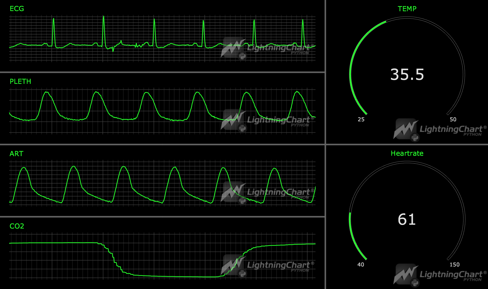

# Real-Time Patient Vital Signs Monitoring Dashboard with LightningChart
## Introduction
**Vital signs** are measurements of the body's basic functions. The vital signs can include various numbers of these measurements.
Usually these vital signs are measured:
- Body temperature
- Heart rate
- Respiratory rate
- Blood pressure
- Oxygen saturation

 
Tracking vital signs is important for detecting health problems, especially those underlying. They also can prevent misdiagnosis.
## LightningChart Python
For this task we may use [LightningChart](https://lightningchart.com/python-charts/) library. It provides a wide range of tools for creating graphs that can be useful for flow cytometry white cell analysis in Python. \
In this project, we will use:
- XY Charts ([Link to docs](https://lightningchart.com/python-charts/docs/charts/chart-xy/)) 
- Gauge Charts ([Link to docs](https://lightningchart.com/python-charts/docs/charts/gauge-chart/))

LightningChart uses GPUs for faster rendering, so it is possible to 'feed' it a huge sample of data (which will be the case in this project).
## Setting Up Python Environment
For creating a vital signs dashboard in Python, first we need to set up our Python environment. 
### Installation of Python on Mac
I recommend using [Homebrew package manager](https://brew.sh/) as it is popular and has a lot of packages.\
Moreover, it is arguably more convenient than installing Python using .dmg.

#### 1. First step is installing Homebrew itself
> You can skip this step if it is already installed on your Mac

Enter Terminal app and copy/paste this string
```sh
/bin/bash -c "$(curl -fsSL https://raw.githubusercontent.com/Homebrew/install/HEAD/install.sh)"
```
:exclamation: **Important note:** 
  Installation of Homebrew can be not fast, usually from 5 to 15 minutes.

#### 2. Installation of Python
```sh
brew install python
```
This command will install the latest stable version of python.


<details>
  <summary><b>If you don't want to use Homebrew</b></summary>
  You can access the <a href = 'https://www.python.org/downloads/macos/'>official Python website</a>, select the      latest stable version downloader for MacOS (it is named macOS 64-bit universal2 installer) and follow the installation instructions.
</details>

You can check the version using `python3 –version` in Terminal.
> If it displays `Unknown command` error, it is most likely due to PATH variables. Refer to  
[this guide](https://www.mygreatlearning.com/blog/add-python-to-path/) to fix.

---
### Installation of Python on Windows
I recommend using cli tool [Winget](https://learn.microsoft.com/en-us/windows/package-manager/winget/). 

#### Install Python package
Open cmd or PowerShell as Administrator and type in:
```powershell
winget install Python.Python.3
```

<details>
  <summary><b>If you don't want to use Winget</b></summary>
  You can access the <a href = 'https://www.python.org/downloads/macos/'>official Python website</a>, select the      latest stable version downloader for Windows <br> (it is named Windows installer (64-bit)) and follow the installation instructions.
</details>

You can verify installation of python and pip by typing `python --version` and `pip --version` respectively. 
> If it displays `'command' is not recognized` error, it is most likely due to PATH variables. Refer to [this guide](https://www.mygreatlearning.com/blog/add-python-to-path/) to fix.

---

### Installation of IDE
For IDE (integrated development environment) I recommend using [PyCharm](https://www.jetbrains.com/pycharm/download/?section=mac) as it is clean and powerful. However, full version is paid so you can also use [VSCode](https://code.visualstudio.com/).

(*Optional*) You may want to set up `venv` (Python virtual environment) so you can install packages there and not clutter the Python installation.
Environment creating instructions:
- PyCharm - https://www.jetbrains.com/help/pycharm/creating-virtual-environment.html#python_create_virtual_env
- VSCode - https://code.visualstudio.com/docs/python/environments

Then, using the terminal (IDEs have integrated terminals) install needed packages:
```sh
pip install pandas lightningchart
```
---
### Libraries Used
#### Pandas
In this project, we will mainly use the dataframe, two-dimensional data structure provided by Pandas. It can be easily created from CSV or Excel file.

#### LightningChart
Lightningchart is the main library used in the project for creating white blood cell flow chart in Python. It provides a highly customizable graph building tools, including simple XY charts, 3D charts, Bar charts, Spider charts, Map charts. However, this time we will use only XY chart (and Point Series).

## Import Needed Libraries
Firstly, we need to import `pandas` and `lightningchart` libraries.
```python
import pandas as pd
import lightningchart as lc
```

## Loading and Processing Data
You can find a lot of medical data at PhysioNet website (https://physionet.org/content/vitaldb/1.0.0/vital_files/#files-panel) \
This dataset with detailed description is also present at [Nature.com](https://www.nature.com/articles/s41597-022-01411-5#Tab2).

You can easily convert `.vital` file to `.csv` by first converting it to pandas dataframe and then to csv.
```python
from vitaldb import VitalFile
vf_df = VitalFile('00001.vital').to_pandas(['SNUADC/ART', 'Solar8000/ART_SBP'], interval=1/100)

csv_file = 'data.csv'
vf_df.to_csv(csv_file, index=False)
```
> You don't need to do that, as the ready-made `.csv` file is located inside `/data` folder in GitHub repo.

To extract data from .csv file and store it in dataframe we need to use `pd.read_csv` function. After this, we need to convert dataframe columns to lists.

```python
df = pd.read_csv('data/data_cut.csv', header=None)  # read csv
df.fillna(0, inplace=True)  # fill NaN values with 0s
df.columns = ['x', 'Primus/CO2', 'SNUADC/ART', 'SNUADC/PLETH', 'SNUADC/ECG_II', 'Solar8000/BT', 'Solar8000/HR']  # name columns
y_ecg = df['SNUADC/ECG_II'].to_list()  # Extract Ys from DataFrame and cast to list
y_pleth = df['SNUADC/PLETH'].to_list()
y_art = df['SNUADC/ART'].to_list()
y_co2 = df['Primus/CO2'].to_list()
temp = df['Solar8000/BT'].to_list()
heartrate = df['Solar8000/HR'].to_list()
x = df['x'].to_list()  # same with Xs
```

## Visualizing Data with LightningChart
Let's initialize Dashboard, and then ChartXY and Gauge charts from LightningChart library. 
Also, we can customize titles.

```python
dashboard = lc.Dashboard(columns=3, rows=4, theme=lc.Themes.Black)  # initialize Dashboard
chart_ecg = dashboard.ChartXY(column_index=0, row_index=0, column_span=2, title='ECG')  # group charts as you like
chart_pleth = dashboard.ChartXY(column_index=0, row_index=1,column_span=2, title='PLETH')
chart_art = dashboard.ChartXY(column_index=0, row_index=2, column_span=2, title='ART')
chart_co2 = dashboard.ChartXY(column_index=0, row_index=3, column_span=2, title='CO2')
chart_temp = dashboard.GaugeChart(column_index=2, row_index=0, row_span=2)
chart_heartrate = dashboard.GaugeChart(column_index=2, row_index=2, row_span=2)

chart_ecg.set_title_position('left-top').set_title_color(lc.Color(0, 255, 0))  # initialize titles
chart_pleth.set_title_position('left-top').set_title_color(lc.Color(0, 255, 0))
chart_art.set_title_position('left-top').set_title_color(lc.Color(0, 255, 0))
chart_co2.set_title_position('left-top').set_title_color(lc.Color(0, 255, 0))
chart_temp.set_title_color(lc.Color(0, 255, 0)).set_label_font(40)
chart_heartrate.set_title_color(lc.Color(0, 255, 0)).set_label_font(40)
```

Then, we need to customize the charts themselves and add series for our data.
```python
series_ecg = chart_ecg.add_line_series(
            data_pattern='ProgressiveX')  # add series to chart
series_ecg.set_line_color(lc.Color(0, 255, 0))  # color the line green
x_axis_ecg = chart_ecg.get_default_x_axis()  # get axis
y_axis_ecg = chart_ecg.get_default_y_axis()  
x_axis_ecg.set_scroll_strategy(strategy='progressive')  # Set the x_axis_ecg to progressive scroll strategy
x_axis_ecg.set_interval(start=-300, end=300, stop_axis_after=False)  # define intervals for x and y
y_axis_ecg.set_default_interval(start=-0.5, end=1)
x_axis_ecg.set_tick_formatting('')  # this feature is experimental and not yet available in public version
y_axis_ecg.set_tick_formatting('')  # of LightningChart library, it removes axis (only visual purpose)
```

Then, we can repeat the same for other 3 XY charts.
```python
series_pleth = chart_pleth.add_line_series(  # same with other series and charts
            data_pattern='ProgressiveX')
series_pleth.set_line_color(lc.Color(0, 255, 0))
x_axis_pleth = chart_pleth.get_default_x_axis()
y_axis_pleth = chart_pleth.get_default_y_axis()
x_axis_pleth.set_scroll_strategy(strategy='progressive')
x_axis_pleth.set_interval(start=-300, end=300, stop_axis_after=False)
y_axis_pleth.set_default_interval(start=20, end=60)
x_axis_pleth.set_tick_formatting('')
y_axis_pleth.set_tick_formatting('')

series_art = chart_art.add_line_series(
            data_pattern='ProgressiveX')
series_art.set_line_color(lc.Color(0, 255, 0))
x_axis_art = chart_art.get_default_x_axis()
y_axis_art = chart_art.get_default_y_axis()
x_axis_art.set_scroll_strategy(strategy='progressive')
x_axis_art.set_interval(start=-300, end=300, stop_axis_after=False)
y_axis_art.set_default_interval(start=50, end=150)
x_axis_art.set_tick_formatting('')
y_axis_art.set_tick_formatting('')

series_co2 = chart_co2.add_line_series(
            data_pattern='ProgressiveX')
series_co2.set_line_color(lc.Color(0, 255, 0))
x_axis_co2 = chart_co2.get_default_x_axis()
y_axis_co2 = chart_co2.get_default_y_axis()
x_axis_co2.set_scroll_strategy(strategy='progressive')
x_axis_co2.set_interval(start=-300, end=300, stop_axis_after=False)
y_axis_co2.set_default_interval(start=0, end=50)
x_axis_co2.set_tick_formatting('')
y_axis_co2.set_tick_formatting('')
```
Now, let's customize the Gauge charts. They have a bit different settings, but similar to the ChartXY. 
```python
chart_temp.set_interval(start=25, end=50)  # range of the chart
chart_temp.set_angle_interval(start=225, end=-45)  # angles (visual)
chart_temp.set_thickness(5)  # thickness of the circle
chart_temp.set_slice_color(lc.Color(0, 255, 0))  # color
chart_temp.set_title('TEMP')  # title
chart_temp.set_animations_enabled(False)  # disable animation to minimize distraction

chart_heartrate.set_interval(start=40, end=150)
chart_heartrate.set_angle_interval(start=225, end=-45)
chart_heartrate.set_thickness(5)
chart_heartrate.set_slice_color(lc.Color(0, 255, 0))
chart_heartrate.set_title('Heartrate')
chart_heartrate.set_animations_enabled(False)
```
Also, we need to set maximum amount of samples to be cached in memory (for progressive chart to display correctly).
```python
series_ecg.set_max_sample_count(10000)
series_pleth.set_max_sample_count(10000)
series_art.set_max_sample_count(10000)
series_co2.set_max_sample_count(10000)
```
Then, we are ready to put data. Remember that we need to do it gradually for progressive chart to work. 
You can experiment with adding multiple entries (5, 10, ...) or changing sleep time.
```python
dashboard.open(live=True)

for point in range(len(x)):
    series_ecg.add(int(x[point]), float(y_ecg[point]))
    series_pleth.add(int(x[point]), float(y_pleth[point]))
    series_art.add(int(x[point]), float(y_art[point]))
    series_co2.add(int(x[point]), float(y_co2[point]))
    if temp[point] != 0:
        chart_temp.set_value(temp[point])

    if heartrate[point] != 0:
        chart_heartrate.set_value(heartrate[point])

    time.sleep(0.01)

dashboard.close()
```
## Result

## Conclusion
In this guide, we created a medical dashboard of vital signs. We used libraries `lightningchart` and `pandas`.
The dashboard consists of the vital signs that are usually measured (ECG, plethysmogram, blood pressure, oxygen saturation, temperature) 
that are nicely grouped and are smooth thanks to libraries used.

With the ready graphs, we can further analyze them. It can also be used for machine learning.

#### Benefits of using LightningChart
LightningChart provides a lot of ready-made options for creating graphs. Otherwise, we would have a headache creating proper charts for Python vital signs dashboard, whilst LightningChart has powerful tools to create XY chart with a huge amount of points in almost no time.

There are lots of other tools in the library, you can review various code snippets for different tasks at [LightningChart Python Guide](https://lightningchart.com/python-charts/docs/).

## Sources used
1. Vital signs and their significance (1) - [medlineplus.gov](https://medlineplus.gov/ency/article/002341.htm)
2. Vital signs and their significance (2) - [healthline.com](https://www.healthline.com/health/what-are-vital-signs)
3. LightningChart - [lightningchart.com](https://lightningchart.com/python-charts/docs/guides/axes/)
4. pandas - [pandas.pydata.org](https://pandas.pydata.org/)